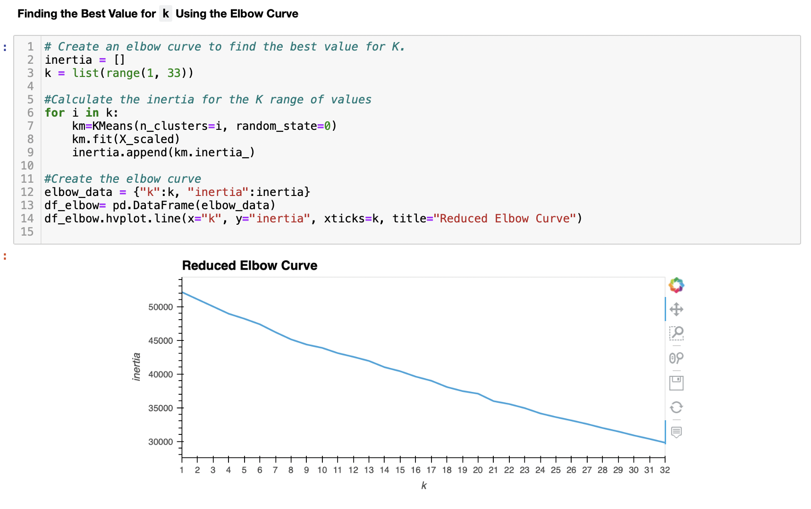

# Cryptocurrencies

## Objective of the analysis 
The objective of this excercise was to use different unsupervised ML models to process, cluster and reduce the dimensions of data and then visualise the results using 2D and 3D scatter plots . I also believe that this excecise illustrates one of the weakness of PCA modelling as the resultant DataFrame represented only 6% of total variance because of the drastic reduction of features from 98 to 3. All dependent modelling would also show similiarly narrow results. 
It is also important to note that K-means modelling did not fare much better against the scaled data set and does not display a notable elbow point even against a large range. 

